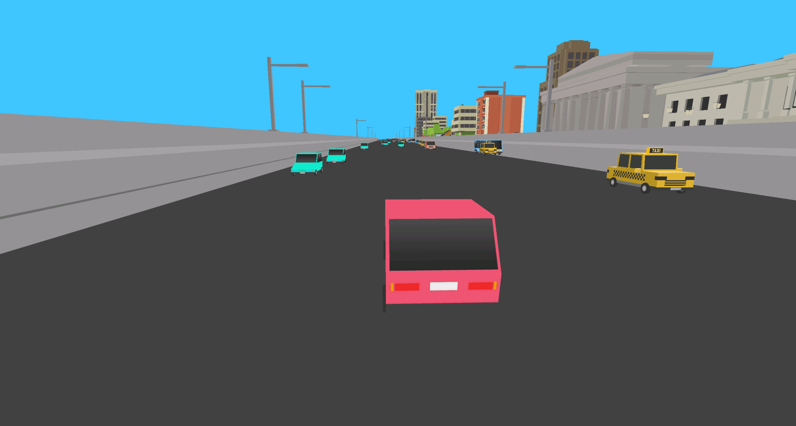
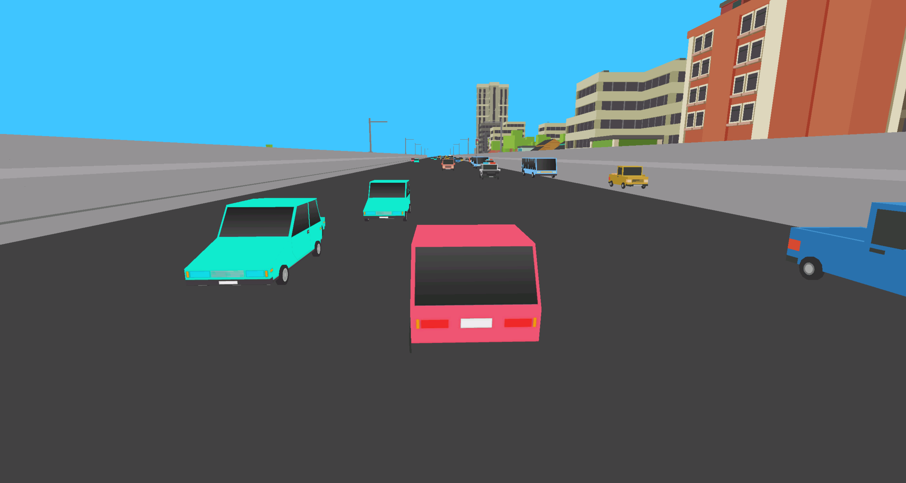

# OpenGL Car Simulation

## Overview
This project is a 3D car simulation using OpenGL, FreeGLUT, and GLM. It simulates car movement, interactions, and animations within a 3D environment. The project supports loading models, physics-based transformations, and real-time rendering.

04.11.2019, Belgorod State Technological University, 2nd year, course on the fundamentals of artificial intelligence

## Features
- **3D Rendering**: Uses OpenGL for rendering objects and environment.
- **Car Movement & Controls**: Implements a physics-based movement system.
- **Model Loading**: Loads `.obj` models dynamically.
- **Camera System**: Includes an interactive camera with movement and rotation.
- **Collision Detection**: Uses ClipperLib for collision detection.
- **Procedural Map Generation**: Dynamically regenerates environment and obstacles.

## Dependencies
- OpenGL
- FreeGLUT
- GLM
- GLFW
- ClipperLib
- TinyOBJLoader

## Installation
1. Clone or download the repository.
2. Ensure dependencies are installed.
3. Compile the project using a C++ compiler with OpenGL support.
4. Run the executable.

## Controls
- `W` - Move forward
- `S` - Move backward
- `A` - Turn left
- `D` - Turn right
- `Q` - Rotate camera left
- `E` - Rotate camera right
- `Z` - Move camera up
- `X` - Move camera down

## Usage
1. Run the application.
2. Control the car using the assigned keys.
3. Observe collisions and animations.
4. Experiment with different model files.

## License
This project is licensed under the MIT License.

